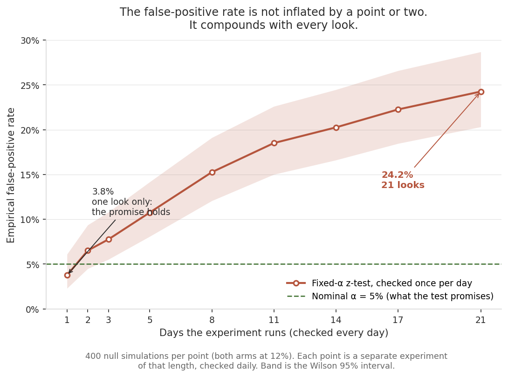
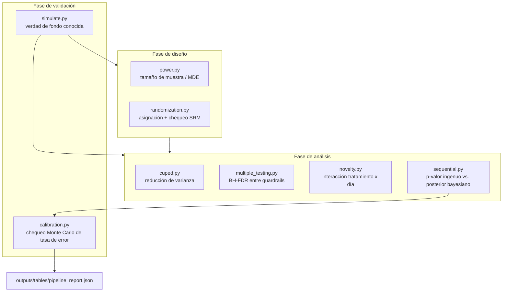
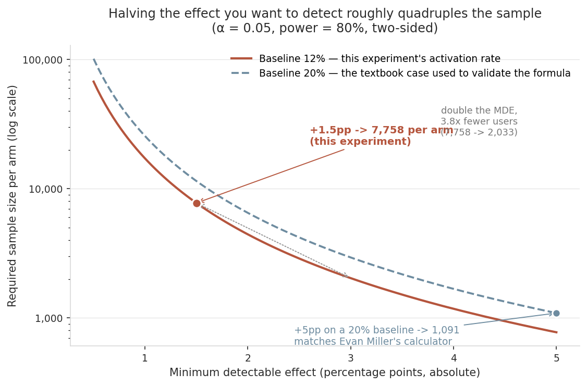
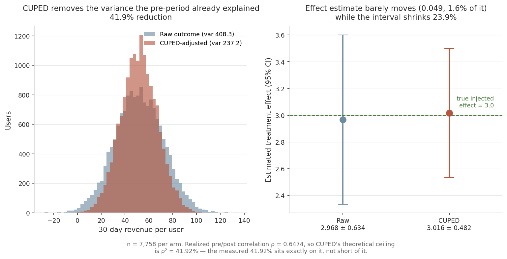
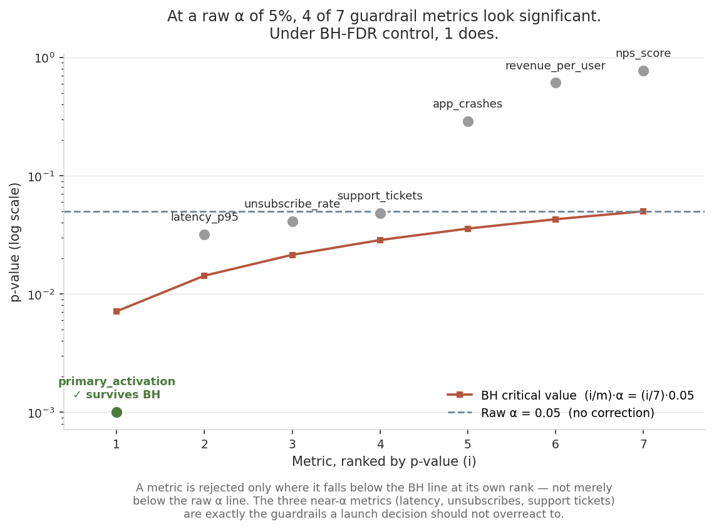
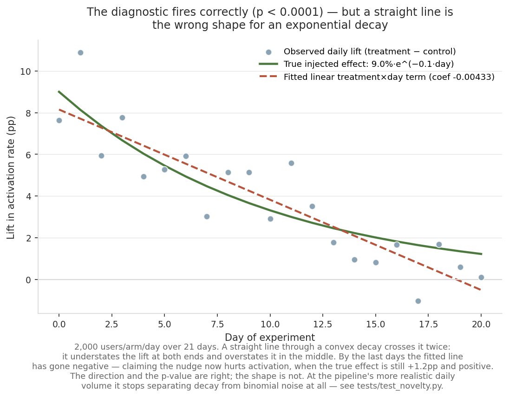
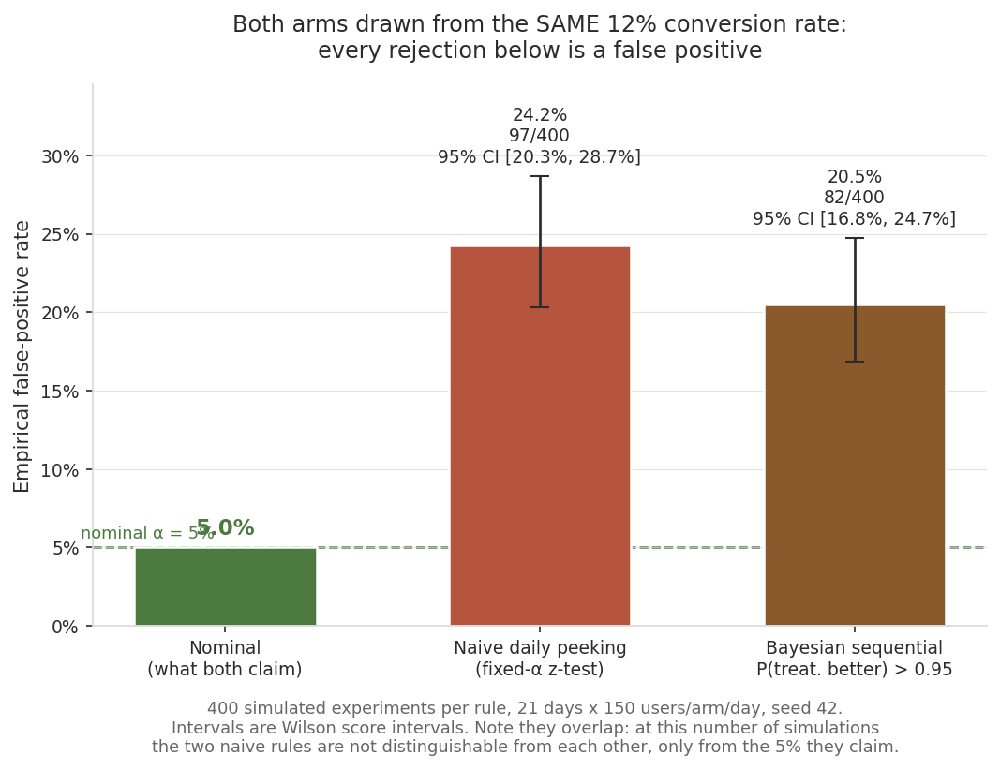

[ 🇨🇱 Español ] | [ 🇺🇸 [Read in English](README.md) ]

# chile-fintech-experimentation-lab

A/B testing como lo tiene que hacer una plataforma de experimentación real: cálculo de tamaño de muestra antes del lanzamiento, detección de Sample Ratio Mismatch (SRM), reducción de varianza con CUPED, corrección por múltiples pruebas entre métricas de guardrail, chequeo de efecto de novedad — y, como pieza central, un arnés de calibración empírica que corre cada regla de detención miles de veces bajo una verdad conocida para comprobar si realmente controla la tasa de error que promete.

**Escenario**: una app fintech chilena prueba un *nudge* dentro de la app que ofrece auto-inscribir al usuario en un producto de ahorro, buscando subir la activación a 30 días. Todos los datos son simulados con un efecto conocido inyectado deliberadamente — la única forma de validar estas técnicas contra una respuesta real, ya que en un experimento real nunca se conoce la verdad de fondo. Cada número de abajo viene de una corrida real de `python -m src.pipeline` (seed 42).

**El hallazgo principal**: revisar una prueba de alfa fijo todos los días en vez de una sola vez al tamaño de muestra planificado no infla la tasa de falsos positivos de 5% a 6% o 7% — la infla a **24.2%**. Cambiar a una regla de detención basada en probabilidad posterior bayesiana, comúnmente asumida como "segura para mirar seguido", casi no ayuda: **20.5%**. Ninguno de los dos métodos ingenuos es seguro. Ese es el punto de construir un arnés de calibración en vez de confiar en la garantía del libro de texto por fe.

La inflación no es una penalidad fija que se podría corregir de una vez — se acumula con cada mirada:



Con una sola mirada la prueba entrega lo que promete (3.8%, consistente con el 5% nominal). El daño lo hace la decisión de seguir mirando, y se acumula con cada día adicional.

## Arquitectura



## Resultados de una corrida real

### 1. Análisis de poder

| | |
|---|---:|
| Tasa de activación baseline | 12.0% |
| Efecto mínimo detectable (absoluto) | +1.5 pp |
| Tamaño de muestra requerido por brazo | **7,758** |



Verificado contra un caso de libro de texto conocido en `tests/test_power.py`: baseline 20%, MDE +5pp absoluto, alfa=0.05, poder=0.80 reproduce **1,091 por brazo**, coincidiendo con la calculadora pública de tamaño de muestra de Evan Miller para el mismo input, verificado a mano desde la fórmula de varianza combinada. Ese punto de validación es el marcador azul del gráfico.

**Cómo leerlo**: el eje y es logarítmico, así que lo empinado de la curva a la izquierda es el costo real de la ambición. Duplicar el MDE de +1.5pp a +3.0pp baja el requerimiento de 7,758 a 2,033 por brazo — un factor de 3.8, cerca del cuadruplicado que implica la relación inversa al cuadrado. Decidir que importa un efecto medio punto más chico no es un cambio menor en el presupuesto del experimento; a este baseline, es la mayor parte de él.

### 2. Aleatorización + chequeo SRM

7,758 vs. 7,758 (exacto, por aleatorización en bloque) — p-valor SRM = 1.0000, sin desajuste. El chequeo mismo está validado en `tests/test_randomization.py` contra un split real de 47/53 sobre 20 mil unidades, que detecta correctamente.

### 3. Reducción de varianza con CUPED

| | Antes | Después |
|---|---:|---:|
| Varianza | 408.33 | 237.17 |



**41.9% de reducción de varianza** usando una covariable de ingresos del período previo. El pipeline especifica una correlación de 0.65; la correlación realizada en la muestra es ρ = 0.6474, así que el techo teórico de CUPED acá es ρ² = **41.92%** — y la reducción medida es **41.9168%**, parada exactamente sobre el techo en vez de quedarse corta. (La reducción que CUPED logra *es* el ρ² empírico, por eso ambos coinciden a cuatro decimales. La única diferencia que vale nombrar es entre el ρ realizado y el 0.65 especificado, que es error de muestreo corriente en la correlación misma, no holgura del método.)

Sobre el efecto del tratamiento: CUPED es insesgado, así que no mueve la estimación de forma sistemática — pero en cualquier muestra finita la estimación puntual realizada se corre un poco, porque θ se estima con los mismos datos. Acá pasa de 2.968 a 3.016, un 1.6% de un efecto inyectado de 3.0, mientras el intervalo de 95% se angosta un 23.9%. `tests/test_cuped.py` codifica exactamente eso: verifica que ambas estimaciones coincidan *dentro de una tolerancia*, no que sean idénticas. CUPED compra un intervalo más angosto alrededor de la misma respuesta, no una respuesta distinta.

### 4. Corrección por múltiples pruebas (BH-FDR) entre 7 métricas de guardrail

| Métrica | p-valor | q-valor BH | ¿Rechaza a α=0.05? |
|---|---:|---:|:---:|
| primary_activation | 0.001 | 0.007 | **Sí** |
| latency_p95 | 0.032 | 0.084 | No |
| unsubscribe_rate | 0.041 | 0.084 | No |
| support_tickets | 0.048 | 0.084 | No |
| app_crashes | 0.290 | 0.406 | No |
| revenue_per_user | 0.610 | 0.712 | No |
| nps_score | 0.770 | 0.770 | No |



Leído a un alfa crudo de 0.05, **4 de 7** métricas parecen significativas. Bajo control BH-FDR, sobrevive solo **1**. Tres de esas cuatro (latencia, cancelaciones, tickets de soporte) son exactamente las métricas de guardrail sobre las que una decisión de lanzamiento debería ser más cautelosa de sobre-reaccionar — para eso sirve la corrección.

**Cómo leerlo**: una métrica se rechaza solo donde cae por debajo de la línea roja de BH *en su propio rango*, que es una vara mucho más exigente que la línea plana del alfa crudo. Las tres métricas cercanas a alfa quedan debajo de la línea punteada de α pero por encima de la de BH — visualmente, esa es toda la diferencia entre "cuatro regresiones, frenen el lanzamiento" y "un efecto real, el resto es la multiplicidad que compraste al medir siete cosas".

### 5. Chequeo de efecto de novedad



Coeficiente de interacción -0.00433, p < 0.0001 — detecta correctamente un efecto de decaimiento inyectado.

**Lo que el gráfico agrega y el coeficiente esconde**: una recta que atraviesa un decaimiento convexo lo cruza dos veces, así que el ajuste subestima el lift en ambos extremos y lo sobreestima en el medio. Hacia los últimos días la recta ajustada se vuelve *negativa* — dice que el nudge ahora perjudica la activación, cuando el efecto real sigue siendo +1.2pp y positivo. La dirección y el p-value están bien; la forma no, y la forma es justamente de lo que depende una decisión de "¿mantenemos esta feature?".

Este diagnóstico además tiene un límite de poder real y medido: al volumen diario más realista del pipeline (`daily_n=500`, `true_effect=0.06`, `novelty_decay=0.12` sobre 30 días), el término lineal tratamiento×día **no** separa de forma confiable un decaimiento exponencial real del ruido binomial diario (`tests/test_novelty.py` documenta la escala exacta — `daily_n=2000`, efecto mayor — necesaria para que el test pase de forma confiable). Un término de interacción lineal es la forma funcional equivocada para un decaimiento genuinamente rápido medido en pocos días; esa limitación se declara aquí en vez de esconderla detrás de una seed con suerte.

### 6. Calibración: ¿cada regla de detención controla lo que promete?

400 experimentos simulados, ambos brazos generados desde la **misma** tasa de conversión real (12%), así que cualquier resultado "significativo" es por definición un falso positivo:

| Método | Tasa de error nominal | Tasa de falsos positivos empírica |
|---|---:|---:|
| Peeking diario ingenuo (z-test de α fijo, revisado cada día) | 5% | **24.2%** (97/400) |
| Secuencial bayesiano (detener cuando P(tratamiento mejor) > 0.95) | ~5% (asumido) | **20.5%** (82/400) |



**Una advertencia que la figura hace visible y la tabla no**: los dos intervalos de Wilson se solapan ([20.3%, 28.7%] y [16.8%, 24.7%]). Con 400 simulaciones la regla bayesiana *no* es distinguible del z-test ingenuo — ambas sí son distinguibles del 5% que prometen, que es el hallazgo, pero "la bayesiana es mejor que la ingenua" no es algo que esta evidencia sostenga. Separarlas requeriría más simulaciones.

`tests/test_calibration.py` fija la inflación del método ingenuo como test de regresión (`> 10%`, muy por encima del 5% nominal). Ninguno de los dos métodos implementados aquí es una forma segura de monitorear un experimento a diario y detenerlo antes de tiempo — esa es la limitación honesta del alcance de este repo: un procedimiento *always-valid* completamente corregido (mixture-SPRT / Johari et al. 2015, o fronteras secuenciales de grupo tipo O'Brien-Fleming) es trabajo de ingeniería real más allá de lo construido acá, y es el módulo natural que sigue, en vez de algo que se asume silenciosamente ya resuelto.

## El toolkit

| Módulo | Qué hace |
|---|---|
| `power.py` | Fórmulas de tamaño de muestra para dos proporciones y dos medias, más el MDE inverso resuelto por bisección |
| `randomization.py` | Aleatorización en bloque a una razón exacta, y un chequeo chi-cuadrado de Sample Ratio Mismatch (α=0.005, el umbral estándar para SRM) |
| `cuped.py` | Reducción de varianza con covariable del período previo; verificado que no altera la estimación puntual del efecto del tratamiento |
| `multiple_testing.py` | Control de FDR por Benjamini-Hochberg entre un panel de métricas de guardrail |
| `novelty.py` | Interacción OLS tratamiento×día con errores estándar robustos HC1 — necesario porque el resultado subyacente es binario (un modelo de probabilidad lineal), heterocedástico por construcción |
| `sequential.py` | Un p-valor ingenuo de alfa fijo y una probabilidad posterior bayesiana Beta-Bernoulli, ambos calculables en cualquier momento del experimento |
| `simulate.py` | Procesos generadores de datos con una verdad de fondo conocida y controlable — experimentos diarios de conversión binaria (con decaimiento de novedad opcional) y resultados continuos de una sola foto con covariable de período previo de correlación exacta |
| `calibration.py` | Repite un experimento simulado completo miles de veces bajo la hipótesis nula para medir la tasa de falsos positivos real de cada regla de detención |
| `make_figures.py` | Redibuja cada figura de este README desde las mismas funciones, constantes y seed que usa el pipeline — nada acá es ilustrativo |

## Un bug real encontrado mientras se construía esto

La función de diagnóstico de `novelty.py` originalmente se llamaba `test_novelty_effect`. Una vez importada en `tests/test_novelty.py`, el colector de pytest tomó el nombre importado — cualquier cosa que empiece con `test_` y que pueda importar — e intentó correrla directamente como test, fallando por falta de fixtures. Se renombró a `detect_novelty_effect`; la colisión y la corrección están documentadas en el propio docstring del módulo.

Un tercero, encontrado al dibujar las figuras y no al escribir el código: este README describía la covariable de CUPED como con "una correlación real de 0.70" contra "el límite teórico de ρ² ≈ 49%", atribuyendo los 7 puntos de diferencia a ruido de muestra finita. El pipeline pasa `covariate_correlation=0.65`, así que el límite nunca fue 49% — y la reducción medida coincide con el ρ² realizado a cuatro decimales, sin diferencia que explicar. Graficarlo fue lo que lo sacó a la luz: el número venía arrastrado en prosa sin recalcularse contra el parámetro que el código realmente usa.

Por separado, la primera versión de esa misma función usaba errores estándar OLS clásicos sobre un resultado binario (0/1) — un modelo de probabilidad lineal, cuya varianza es `p(x)(1-p(x))` y por lo tanto cambia con `x` por construcción. OLS clásico asume varianza constante; cambiar a errores estándar robustos a heterocedasticidad (HC1) fue necesario para controlar la tasa de falsas alarmas de novedad sobre un dataset genuinamente nulo (efecto constante).

## Cómo correrlo de principio a fin

```bash
python -m venv .venv
.venv/Scripts/activate   # o source .venv/bin/activate en Linux/macOS
pip install -r requirements.txt
python -m pytest -v        # 29 tests, ninguno mockeado
python -m src.pipeline     # reporte completo, imprime en consola + outputs/tables/pipeline_report.json
python -m src.make_figures # redibuja las seis figuras de arriba en outputs/figures/
```

`make_figures.py` importa las mismas funciones y reutiliza las mismas constantes y seed (42) que `pipeline.py`, así que los números anotados en los gráficos son los números que imprime el pipeline. Correrlo es la forma de comprobarlo.

## Licencia

MIT — ver [LICENSE](LICENSE).
