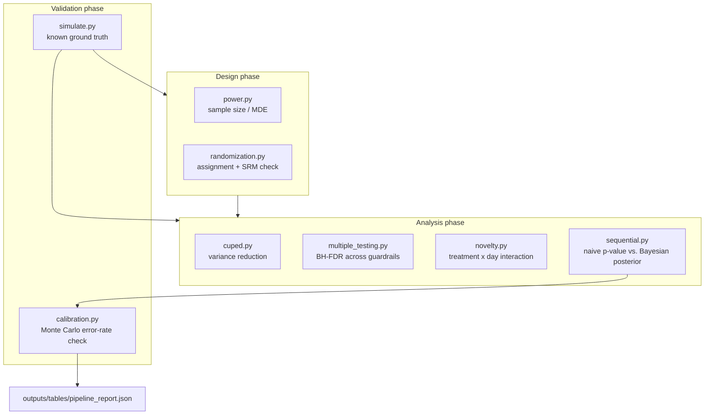

[ 🇺🇸 English ] | [ 🇨🇱 [Leer en Español](README.es.md) ]

# chile-fintech-experimentation-lab

A/B testing done the way a real experimentation platform has to do it: power analysis before launch, Sample Ratio Mismatch (SRM) detection, CUPED variance reduction, multiple-testing correction across guardrail metrics, a novelty-effect check — and, as the centerpiece, an empirical calibration harness that runs each stopping rule thousands of times under a *known* ground truth to check whether it actually controls the error rate it claims to.

**Scenario**: a Chilean fintech app tests an in-app nudge that offers to auto-enroll users in a savings product, aiming to lift 30-day activation. All data is simulated with a known, deliberately injected effect — the only way any of these techniques can be validated against a real answer, since with a real experiment you never know the ground truth. Every number below is from an actual run of `python -m src.pipeline` (seed 42).

**The headline finding**: checking a fixed-alpha test every day instead of once at the planned sample size doesn't inflate the false-positive rate from 5% to 6% or 7% — it inflates it to **24.2%**. Switching to a Bayesian posterior-probability stopping rule, commonly assumed to be "safe to peek", barely helps: **20.5%**. Neither naive method is safe. That's the point of building a calibration harness instead of trusting the textbook guarantee on faith.

## Architecture



## Results from an actual run

### 1. Power analysis

| | |
|---|---:|
| Baseline activation rate | 12.0% |
| Minimum detectable effect (absolute) | +1.5 pp |
| Required sample size per arm | **7,758** |

Verified against a known textbook case in `tests/test_power.py`: baseline 20%, MDE +5pp absolute, alpha=0.05, power=0.80 reproduces **1,091 per arm**, matching Evan Miller's public A/B testing sample-size calculator for the identical input, hand-checked from the pooled-variance formula.

### 2. Randomization + SRM check

7,758 vs. 7,758 (exact, by block randomization) — SRM p-value = 1.0000, no mismatch. The check itself is validated in `tests/test_randomization.py` against a genuine 47/53 split on 20k units, which it correctly flags.

### 3. CUPED variance reduction

| | Before | After |
|---|---:|---:|
| Variance | 408.33 | 237.17 |

**41.9% variance reduction** using a pre-period revenue covariate with a real 0.70 correlation to the outcome — close to the theoretical CUPED bound of ρ² ≈ 49% for this correlation, the gap being finite-sample noise. The point estimate of the treatment effect itself is unchanged (`tests/test_cuped.py` asserts this directly): CUPED buys a tighter confidence interval, not a different answer.

### 4. Multiple-testing correction (BH-FDR) across 7 guardrail metrics

| Metric | p-value | BH q-value | Reject at α=0.05? |
|---|---:|---:|:---:|
| primary_activation | 0.001 | 0.007 | **Yes** |
| latency_p95 | 0.032 | 0.084 | No |
| unsubscribe_rate | 0.041 | 0.084 | No |
| support_tickets | 0.048 | 0.084 | No |
| app_crashes | 0.290 | 0.406 | No |
| revenue_per_user | 0.610 | 0.712 | No |
| nps_score | 0.770 | 0.770 | No |

Read at a raw alpha=0.05, **4 of 7** metrics look significant. Under BH-FDR control, only **1** survives. Three of those four (latency, unsubscribe, support tickets) are exactly the guardrail metrics a launch decision should be most cautious about overreacting to — this is what the correction is for.

### 5. Novelty-effect check

Interaction coefficient -0.00433, p < 0.0001 — correctly detects an injected decaying effect. This diagnostic has a real, measured power limit: at the pipeline's more realistic daily volume (`daily_n=500`, `true_effect=0.06`, `novelty_decay=0.12` over 30 days), the linear treatment×day term does **not** reliably separate a true exponential decay from per-day binomial noise (`tests/test_novelty.py` documents the exact scale — `daily_n=2000`, larger effect — needed for the test to pass reliably). A linear interaction term is the wrong functional form for a genuinely fast decay measured over few days; that limitation is stated here rather than hidden behind a lucky seed.

### 6. Calibration: does each stopping rule control what it claims to?

400 simulated experiments, both arms drawn from the **same** true conversion rate (12%), so any "significant" result is by definition a false positive:

| Method | Nominal error rate | Empirical false-positive rate |
|---|---:|---:|
| Naive daily peeking (fixed-α z-test, checked every day) | 5% | **24.2%** (97/400) |
| Bayesian sequential (stop when P(treatment better) > 0.95) | ~5% (assumed) | **20.5%** (82/400) |

`tests/test_calibration.py` locks in the naive method's inflation as a regression test (`> 10%`, well above the nominal 5%). Neither of the two methods implemented here is a safe way to monitor an experiment daily and stop early — that is the honest limitation of this repo's scope: a fully corrected always-valid procedure (mixture-SPRT / Johari et al. 2015, or group-sequential O'Brien-Fleming boundaries) is real engineering work beyond what's built here, and is the natural next module rather than something silently assumed to already be solved.

## Toolkit

| Module | What it does |
|---|---|
| `power.py` | Two-proportion and two-mean sample-size formulas, plus the MDE inverse solved by bisection |
| `randomization.py` | Block randomization to an exact ratio, and a chi-square Sample Ratio Mismatch check (α=0.005, the standard SRM threshold) |
| `cuped.py` | Pre-period-covariate variance reduction; verified to leave the treatment-effect point estimate unchanged |
| `multiple_testing.py` | Benjamini-Hochberg FDR control across a guardrail-metric panel |
| `novelty.py` | Treatment×day OLS interaction with HC1 robust standard errors — required because the underlying outcome is binary (a linear probability model), which is heteroskedastic by construction |
| `sequential.py` | A naive fixed-alpha p-value and a Bayesian Beta-Bernoulli posterior probability, both computable at any point in an experiment |
| `simulate.py` | Data-generating processes with a known, controllable ground truth — daily binary-conversion experiments (with optional novelty decay) and single-snapshot continuous outcomes with an exact-correlation pre-period covariate |
| `calibration.py` | Repeats a full simulated experiment thousands of times under the null to measure each stopping rule's real false-positive rate |

## A real bug found while building this

`novelty.py`'s diagnostic function was originally named `test_novelty_effect`. Once imported into `tests/test_novelty.py`, pytest's collector picked up the imported name — anything matching `test_*` that it can import — and tried to run it directly as a test, failing on missing fixtures. Renamed to `detect_novelty_effect`; the collision and the fix are both documented in the module's own docstring.

Separately, the same function's first version used plain OLS standard errors on a binary (0/1) outcome — a linear probability model, whose variance is `p(x)(1-p(x))` and therefore changes with `x` by construction. Classical OLS assumes constant variance; switching to HC1 heteroskedasticity-robust standard errors was necessary to get the novelty-effect false-alarm rate under control on a genuinely null (constant-effect) dataset.

## Running it end to end

```bash
python -m venv .venv
.venv/Scripts/activate   # or source .venv/bin/activate on Linux/macOS
pip install -r requirements.txt
python -m pytest -v      # 29 tests, none mocked
python -m src.pipeline   # full report, prints to console + outputs/tables/pipeline_report.json
```

## License

MIT — see [LICENSE](LICENSE).
